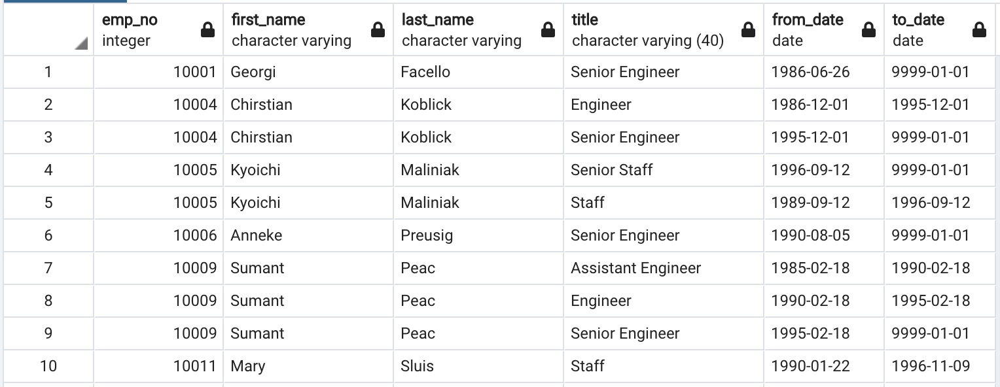
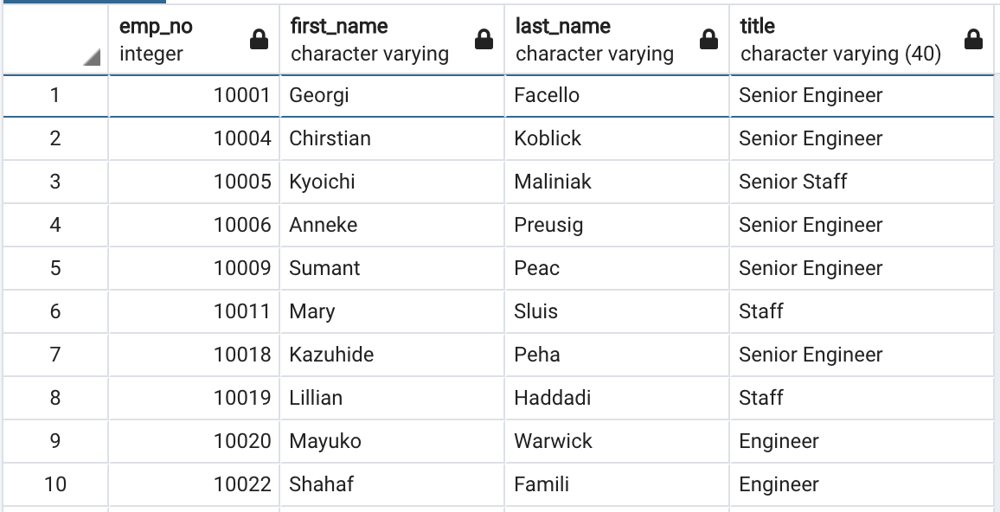
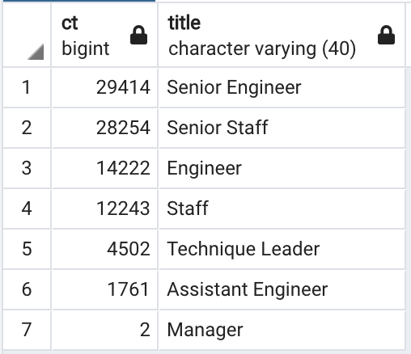
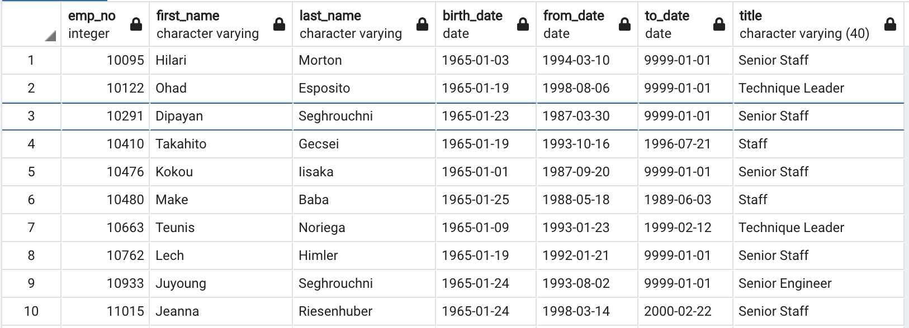

# Pewlett Hackard 

## Overview of the analysis

The goal of this analysis is to help tp prepare Bobby’s manager for the “silver tsunami” as many current employees reach retirement age by determining the number of retiring employees per title, and identify employees who are eligible to participate in a mentorship program.

## Results

Bellow we can find a Retirement Titles table that holds all the titles of current employees who were born between January 1, 1952 and December 31, 1955. 

### Fig 1. Retirements Titles table

Because some employees may have multiple titles in the database—for example, due to promotions, a DISTINCT ON statement was used to create a table that contains the most recent title of each employee. 

### Fig 2. Unique Titles table

After that the COUNT() function was used to create a final table that has the number of retirement-age employees by most recent job title.

### Fig 3. Retiring Titles

Lastly, a table was created to determine the employees who are eligible to participate in a mentorship program.

### Fig 4. Mentoship Eligibility

Summary:

* Currently, 90398 roles will need to be filled as the "silver tsunami" begins to make an impact. Query: `SELECT count(DISTINCT (emp_no)) FROM retirement_titles`

* There are 1940 enough qualified, retirement-ready employees in the departments to mentor the next generation of Pewlett Hackard employees. Query: `SELECT COUNT(emp_no) FROM mentorship_eligibility`

* From the 90398 employees that will retire, 21209 were born in 1952, which will the the first batch of employees to retire. Query: `SELECT COUNT(emp_no) FROM employees WHERE birth_date BETWEEN '1952-01-01' AND '1952-12-31'>`

* From the 1940 employees eligible for mentorship, 633 are entitled as 'Senior Staff', 610 as 'Senior Engineer' and 99 as 'Technique Leader'. There is a need to ensure there are mentorship content available for these more senior titles. Query: `'SELECT COUNT(*) AS count,title FROM mentorship_eligibility GROUP BY title ORDER BY count DESC`
